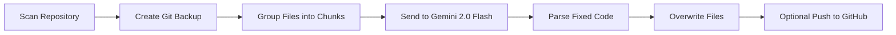

# 💎 Repo-Fixer - AI Repository Self-Healing Engine

[](https://opensource.org/licenses/MIT)
[](https://www.python.org/downloads/)
[](https://ai.google.dev/gemini)

An AI-powered tool that automatically scans your entire codebase, fixes bugs, syntax errors, and logic issues using **Google Gemini 2.0 Flash**.

Built for **Termux**, **Linux**, and **Mac**. Token-based mode to avoid API quota limits.

---

## ✨ Features

- **Token-Based Scanning**: Joins 10-15 files into 1 API call to save quota
- **Auto Fix + Save**: Scans, fixes, and overwrites files automatically
- **Multi-Language Support**: Python, JS, TS, JSX, TSX, JSON, HTML, CSS
- **Git Integration**: Auto `git pull` and `git commit` backup before fixing
- **Smart Push**: Asks to push fixed code to GitHub automatically
- **Quota Friendly**: 69 files = Only 4-5 API calls instead of 69

---

## 🚀 Quick Start

### 1. Requirements

```bash
# For Termux
pkg update && pkg upgrade
pkg install python git

# For Linux/Mac
sudo apt update && sudo apt install python3 git  # Ubuntu/Debian
brew install python git                          # macOS
```
Install Python dependency:
```
pip install requests
```
2. Get Gemini API Key
Get free key from: Google AI Studio

Free tier: 50 requests/day

Model: gemini-2.0-flash (fastest and most capable)

3. Setup
```
cd ~
git clone https://github.com/YOUR_USERNAME.git
export GEMINI_API_KEY="PASTE_YOUR_KEY_HERE"
```
4. Run
```
python repo-fixer.py
```
When prompted, enter your repo path:
```
/data/data/com.termux/files/home/repository
```
## 📁 How It Works



1. **Backup**: Creates a git commit before making changes
2. **Chunking**: Groups files into ∼80k character chunks
3. **AI Fix**: Sends chunks to `gemini-2.0-flash` for bug fixing
4. **Apply**: Parses response and overwrites files with fixed code
5. **Push**: Optional auto push to origin/main

   

---

## 🚀 Now let's create additional files for your repository:

### 📃 LICENSE (MIT License)
```markdown
MIT License

Copyright (c) 2026 Apiload5

Permission is hereby granted, free of charge, to any person obtaining a copy
of this software and associated documentation files (the "Software"), to deal
in the Software without restriction, including without limitation the rights
to use, copy, modify, merge, publish, distribute, sublicense, and/or sell
copies of the Software, and to permit persons to whom the Software is
furnished to do so, subject to the following conditions:

The above copyright notice and this permission notice shall be included in all
copies or substantial portions of the Software.

THE SOFTWARE IS PROVIDED "AS IS", WITHOUT WARRANTY OF ANY KIND, EXPRESS OR
IMPLIED, INCLUDING BUT NOT LIMITED TO THE WARRANTIES OF MERCHANTABILITY,
FITNESS FOR A PARTICULAR PURPOSE AND NONINFRINGEMENT. IN NO EVENT SHALL THE
AUTHORS OR COPYRIGHT HOLDERS BE LIABLE FOR ANY CLAIM, DAMAGES OR OTHER
LIABILITY, WHETHER IN AN ACTION OF CONTRACT, TORT OR OTHERWISE, ARISING FROM,
OUT OF OR IN CONNECTION WITH THE SOFTWARE OR THE USE OR OTHER DEALINGS IN THE
SOFTWARE.
```

👨‍💻 Author
M Amir

GitHub: @apiload5

Project: repo-fixer
